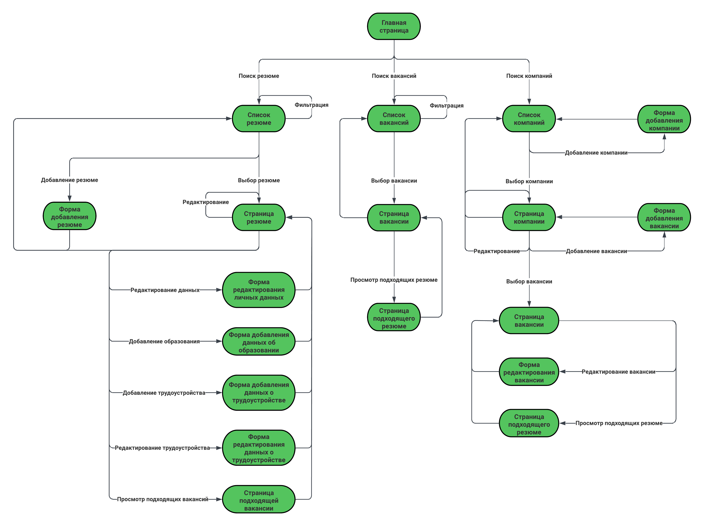
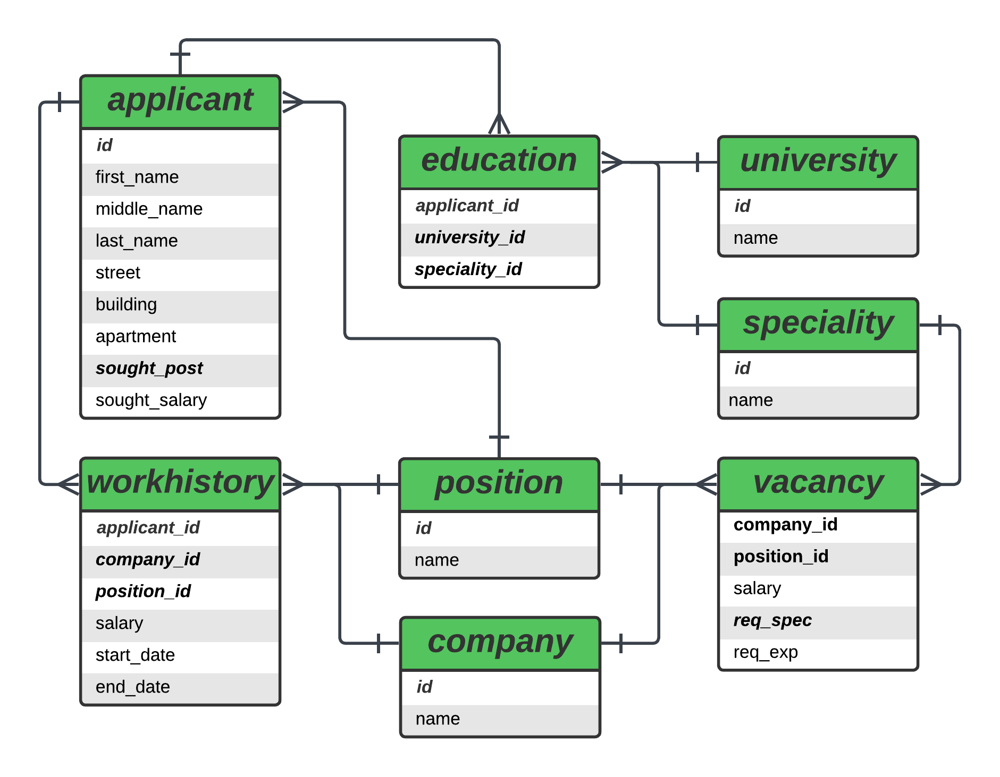

# Кадровое агентство

# RAS - Recruitment and Assessment Services

Кадровое агентство специализируется на поиске и предоставлении квалифицированного персонала для различных компаний, обратившихся за помощью. Этот процесс включает в себя тщательный отбор кандидатов и проведение собеседований для проверки их профессиональных навыков и соответствия требованиям работодателей.

Для эффективного ведения работы менеджерам кадрового агентства необходимо постоянно поддерживать актуальность информации о работодателях и соискателях. В этой связи предлагается использовать специализированное приложение, которое упрощает доступ к базе данных резюме и вакансий. Такое приложение существенно оптимизирует процесс поиска персонала, делая его более эффективным и удобным.

`  `

## Схема навигации между страницами

`  `

## Схема базы данных

