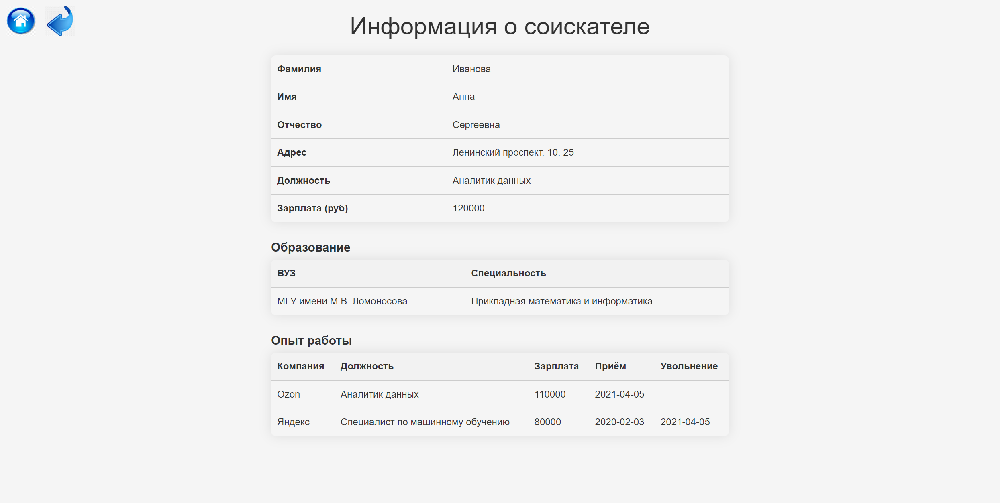

# Кадровое агентство RAS - Recruitment and Assessment Services

Кадровое агентство специализируется на поиске и предоставлении квалифицированного персонала для различных компаний, обратившихся за помощью. Этот процесс включает в себя тщательный отбор кандидатов и проведение собеседований для проверки их профессиональных навыков и соответствия требованиям работодателей.

Для эффективного ведения работы менеджерам кадрового агентства необходимо постоянно поддерживать актуальность информации о работодателях и соискателях. В этой связи предлагается использовать специализированное приложение, которое упрощает доступ к базе данных резюме и вакансий. Такое приложение существенно оптимизирует процесс поиска персонала, делая его более эффективным и удобным.

  

## Схема навигации между страницами

  

## Схема базы данных

  

## Скрины всех страниц

- **Главная страница**

  

    

- **Список резюме**

  

    

- **Форма добавления резюме**

  

    

- **Страница резюме**

  

    

- **Форма редактирования личных данных**

  

    

- **Форма добавления данных об образовании**

  

    

- **Форма добавления данных о трудоустройстве**

  

    

- **Форма редактирования данных о трудоустройстве**

  

    

- **Страница подходящей вакансии**

  

    
  
- **Список вакансий**

  

    

- **Страница вакансии**

  

    

- **Страница подходящего резюме**

  

    

- **Список компаний**

  

    

- **Форма добавления компании**

  

    

- **Страница компании**

  

    

- **Форма добавления вакансии**

  

    

- **Страница вакансии**

  

    

- **Форма редактирования вакансии**

  

    

- **Страница подходящего резюме**

  

    
