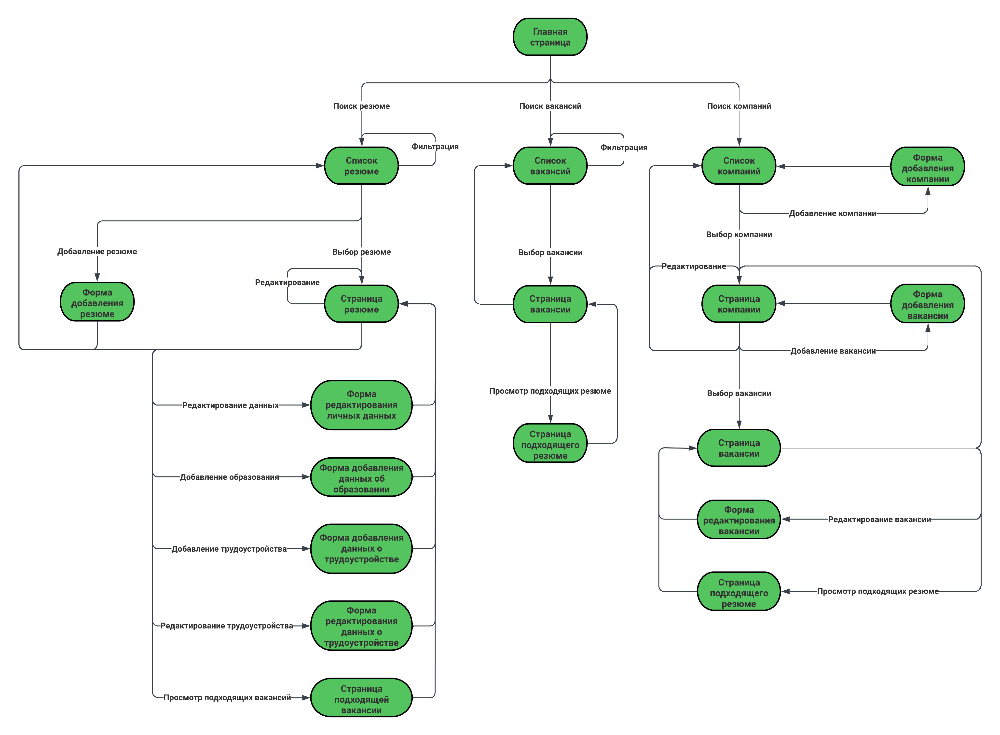

# Кадровое агентство
# RAS - Recruitment and Assessment Services
Кадровое агентство специализируется на поиске и предоставлении квалифицированного персонала для различных компаний, обратившихся за помощью. Этот процесс включает в себя тщательный отбор кандидатов и проведение собеседований для проверки их профессиональных навыков и соответствия требованиям работодателей.

Для эффективного ведения работы менеджерам кадрового агентства необходимо постоянно поддерживать актуальность информации о работодателях и соискателях. В этой связи предлагается использовать специализированное приложение, которое упрощает доступ к базе данных резюме и вакансий. Такое приложение существенно оптимизирует процесс поиска персонала, делая его более эффективным и удобным.

  

## Схема навигации между страницами

 

С любой страницы можно перейти на главную и на предыдущие

 

**Главная страница**
-	Приветственная информация об агентстве 
-	Раздел компаний со ссылкой на соответствующую страницу
-	Раздел вакансий со ссылкой на соответствующую страницу
-	Раздел соискателей со ссылкой на соответствующую страницу

 

**Список резюме**
- По умолчанию - отображение последних 10 резюме с краткой информацией: ФИО, искомая должность, желаемая зарплата и ссылка на страницу данного резюме с более подробным содержанием
- Возможно применение фильтрации по различным параметрам: специальность, бывшие места работы, занимаемые должности, зарплаты
- Отображение ссылки на форму для добавления резюме

 

**Форма добавления резюме**
- Необходимо заполнение полей: ФИО, домашний адрес, образование (ВУЗы и специальности), история работы (компании, занимаемые должности, зарплаты, периоды), искомая работа и желаемая зарплата
- После заполнения осуществляется переход на предыдущую страницу

 

**Страница резюме**
- Отображение полной информация о соискателе: ФИО, домашний адрес, образование (ВУЗы и специальности), история работы (компании, занимаемые должности, зарплаты, периоды), искомая работа и желаемая зарплата
- Возможно редактирование данной информации
- Отображение ссылки на подходящие вакансии

 

**Подходящие вакансии**
- Отображение списка вакансий с краткой информацией: компания, должность, зарплата и ссылка на страницу данной вакансий с более подробным содержанием

 

**Список вакансий**
- Отображение списка вакансий с краткой информацией: компания, должность, зарплата и ссылка на страницу данной вакансии с более подробным содержанием
- Возможно применение фильтрации по различным параметрам: компания, должность, зарплата

 

**Страница вакансии**
- Отображение полной информации о вакансии: компания, должность, зарплата, требования к образованию (специальность), требования в послужному списку (должность и стаж)
- Возможно редактирование данной информации
- Отображение ссылки на подходящие резюме

 

**Подходящие резюме**
- Отображение списка резюме с краткой информацией: ФИО, искомая должность, желаемая зарплата и ссылка на страницу данного резюме с более подробным содержанием

 

**Список компаний**
- Отображение списка компаний и ссылок на страницы с более подробным содержанием
- Отображение ссылки на форму для добавления компании

 

**Форма добавления компании**
- Необходимо заполнение формы с указанием названия компании
- После заполнения осуществляется переход на предыдущую страницу

 

**Страница компании**
- Отображение всех вакансий от данной компании с краткой информацией: должность, зарплата и ссылки на страницы вакансий с более подробным содержанием
- Возможно редактирование информации
- Отображение ссылки на форму для добавление вакансии

 

**Форма добавления вакансии**
- Необходимо заполнение полей: должность, зарплата, требования к образованию (специальность), требования в послужному списку (должность и стаж)
- После заполнения осуществляется переход на предыдущую страницу

  

## Сценарии использования

**Добавление резюме**
- Главная страница -> Список резюме -> Форма добавления резюме

 

**Добавление компании**
- Главная страница -> Список компаний -> Форма добавления компании

 

**Добавление вакансии**
- Главная страница -> Список компаний -> Страница компании -> Форма добавления вакансии

 

**Редактирование резюме**
- Главная страница -> Список резюме -> Страница резюме -> Редактирование

 

**Редактирование компании**
- Главная страница -> Список компаний -> Страница компании -> Редактирование

 

**Редактирование вакансии**
- Главная страница -> Список вакансий -> Страница вакансии -> Редактирование
- Главная страница -> Список компаний -> Страница компании -> Страница вакансии -> Редактирование

 

**Фильтрация резюме**
- Главная страница -> Cписок резюме -> Фильтрация

 

**Фильтрация вакансий**
- Главная страница -> Cписок вакансий -> Фильтрация

 

**Поиск подходящих резюме**
- Главная страница -> Список вакансий -> Страница вакансии -> Поиск подходящих резюме
- Главная страница -> Список компаний -> Страница компании -> Страница вакансии -> Поиск подходящих резюме

 

**Поиск подходящих вакансий**
- Главная страница -> Список резюме -> Страница резюме -> Поиск подходящих вакансий

  

## Схема базы данных

